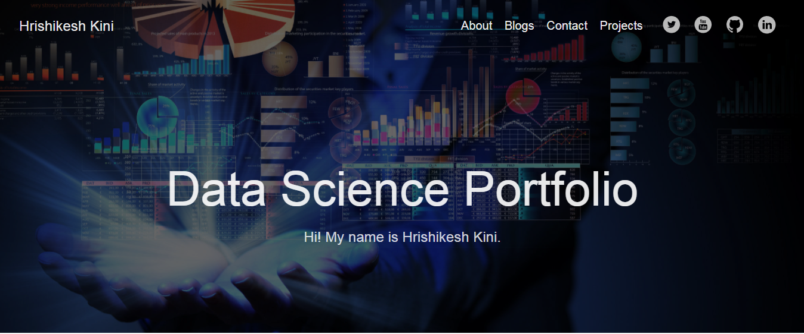

# End_to_End_Data_Science_Projects

  

  
Hi, my name is Hrishikesh Kini.

I am Hrishikesh Kini, aspiring data scientist who enjoys connecting the dots: be it ideas from different disciplines, people from different teams, or applications from different industries. I have strong technical skills and an academic background in engineering, statistics, and machine learning.

# Get to Know Me 

### My Portfolio Website

  
  
 I built the site in Hugo using pieces of an existing design on <a href="https://gohugo.io/">Hugo</a>. Though I am not interested in Front-End Development, I created and deployed this website on a <a href="https://github.com/">github</a> server so that I could learn more about web app design and back-end development. Though I did learn a lot from making this website, much of the joy that came from this project was found making something of my own and putting it out into the world.

  
  

# My Past Projects

### [Water Quality : Drinking water potability](https://github.com/hrishikeshkini/Water-Quality-Drinking-water-potability)

 Contaminated water and poor sanitation are linked to transmission of diseases such as cholera, diarrhoea, dysentery, hepatitis A, typhoid, and polio. Absent, inadequate, or inappropriately managed water and sanitation services expose individuals to preventable health risks. This is particularly the case in health care facilities where both patients and staff are placed at additional risk of infection and disease when water, sanitation, and hygiene services are lacking. Globally, 15% of patients develop an infection during a hospital stay, with the proportion much greater in low-income countries.

So, I took some inspiration from this to use this Water Quality dataset to understand what consitutes to safe, Potable water and apply machine learning to it to distinguish between Potable and Non-Potable water.
 

### [Carinfinity machine learning project](https://github.com/hrishikeshkini/Carinfinity_machine_learning_project)

 This is my final year project. This is second hand car buying and selling website. This project uses machine learning to predict the price of second hand cars. I have used XGBoost regressor to predict the data.
 

### [Pima Indians diabetes](https://github.com/hrishikeshkini/pima-indians-diabetes)

The main goal of this project is to predict whether the person is positive or negative for Diabetes.
 

### [Movie Recommender System](https://github.com/hrishikeshkini/movie-recommender-system)

The main goal of this project is to recommend the 5 movies based on user interest.

### [Dog Breed Prediction](https://github.com/hrishikeshkini/Dog-Breed-Prediction)

The main goal of this project is to predict the breeds of different dogs available in the provided dataset.
 

# Other-Projects

- Heart Attack Risk predictor <a href="https://github.com/hrishikeshkini/Heart-Attack-Risk-Predictor-with-AutoML">Jupyter Notebook</a>

- Mall Customer Segmentation <a href="https://github.com/hrishikeshkini/Mall-Customer-Segmentation">Jupyter Notebook</a>

- Live face mask detection <a href="https://github.com/hrishikeshkini/live-face-mask-detection">Jupyter Notebook</a>

## More projects on my portfolio webiste

### Thank You

